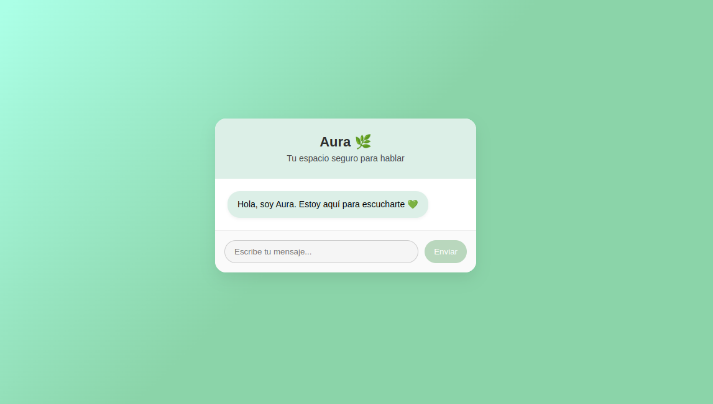

# 🤖 Chatbot API experto en Python
Este proyecto es una API REST basada en FastAPI que funciona como un chatbot experto en Python. Utiliza el modelo Mistral a través de OpenRouter (compatible con la API de OpenAI) para generar respuestas conversacionales.

## 🚀 Requisitos
- Python 3.8 o superior
- Tener una API Key de OpenRouter
- Conexión a internet

_____

## 🪩 Vista previa 

_______